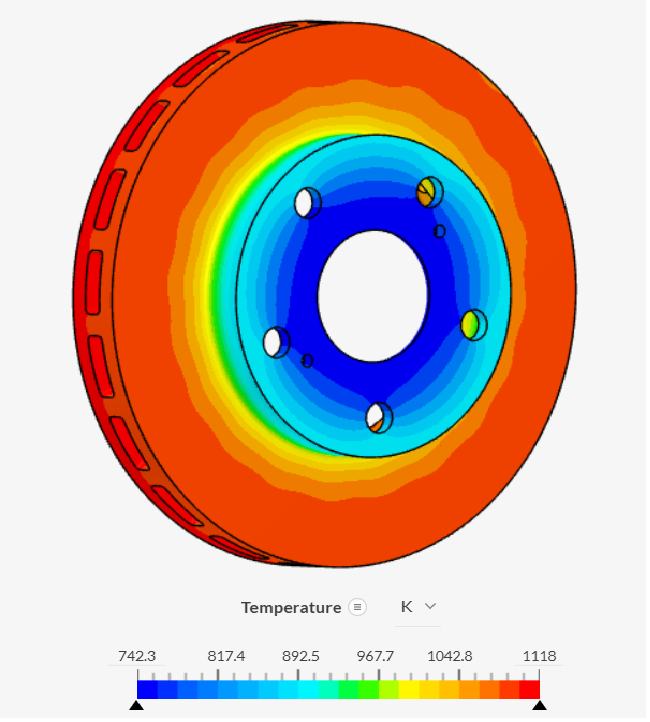
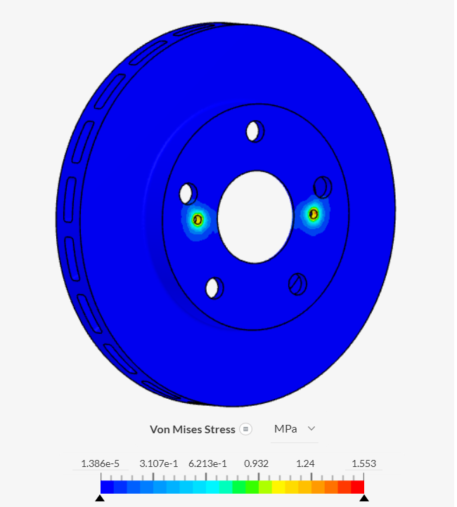
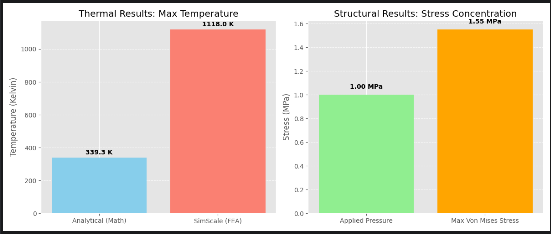

# High-Performance Ventilated Brake Disc: Thermal & Structural Analysis

## 🎯 Project Overview
This project presents a comprehensive engineering study of an automotive ventilated brake disc. The objective was to evaluate the thermal dissipation performance during high-speed braking and the structural integrity under pad clamping pressure. 

The project follows a rigorous engineering workflow: **CAD Design -> FEA Simulation -> Analytical Validation using Python.**

---

## 🛠 Tech Stack
* **CAD:** Onshape (Radial Ventilated Design)
* **FEA Simulation:** SimScale (Steady-State Thermal & Static Structural)
* **Programming:** Python 3 (Matplotlib, NumPy)
* **Material:** Gray Cast Iron (ASTM A48)

---

## 🌡 Phase 1: Thermal Analysis (SimScale)
### The Scenario
Simulating an emergency stop from **100 km/h** to **0 km/h**. The kinetic energy of the vehicle is converted into thermal energy through friction.

### Key Results
* **Maximum Temperature:** **1118 K** ($845^\circ C$).
* **Observation:** The internal radial vents successfully created a temperature gradient, keeping the center hub significantly cooler than the friction surface.

---

## 🏗 Phase 2: Static Structural Analysis (SimScale)
### The Scenario
Evaluation of the clamping force applied by the brake calipers. This test ensures that the pressure does not cause material failure or excessive warping.

### Key Results
* **Max Von Mises Stress:** **1.55 MPa**.
* **Safety Factor:** Extremely high (>100), as Gray Cast Iron has a yield strength of ~150-200 MPa.
* **Finding:** Identified stress concentrations around the mounting bolt holes ("Stress Risers").

---

## 🐍 Data Validation & Sensitivity Study (Python)
To ensure the simulation was physically accurate, I developed a Python-based Digital Twin to compare analytical hand calculations with the SimScale numerical output.

### 1. Result Comparison
I correlated the peak temperature and applied pressure. While the analytical model assumes even heat distribution, the FEA correctly identifies localized hotspots.

### 2. Sensitivity Analysis: Vehicle Mass vs. Temperature
I performed a parametric study to determine how vehicle weight impacts thermal load. This graph confirms that the design remains within safe temperature limits ($<1420 K$) for vehicles up to 2500 kg.

---

## 📂 Repository Contents
* `Brake_disc.STEP`: 3D Geometry used for analysis.
* `*.png`: High-resolution simulation results and validation charts.

## 🚀 Conclusion
The ventilated design effectively manages extreme thermal loads. While peak temperatures reached **1118 K**, the structural stress remained well within the material's elastic limit, proving the design's reliability for high-performance automotive applications.
